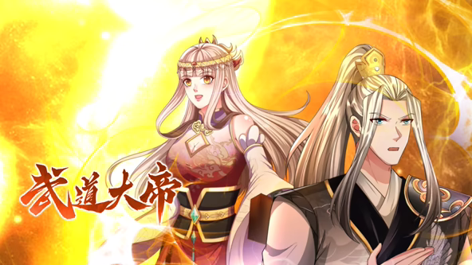
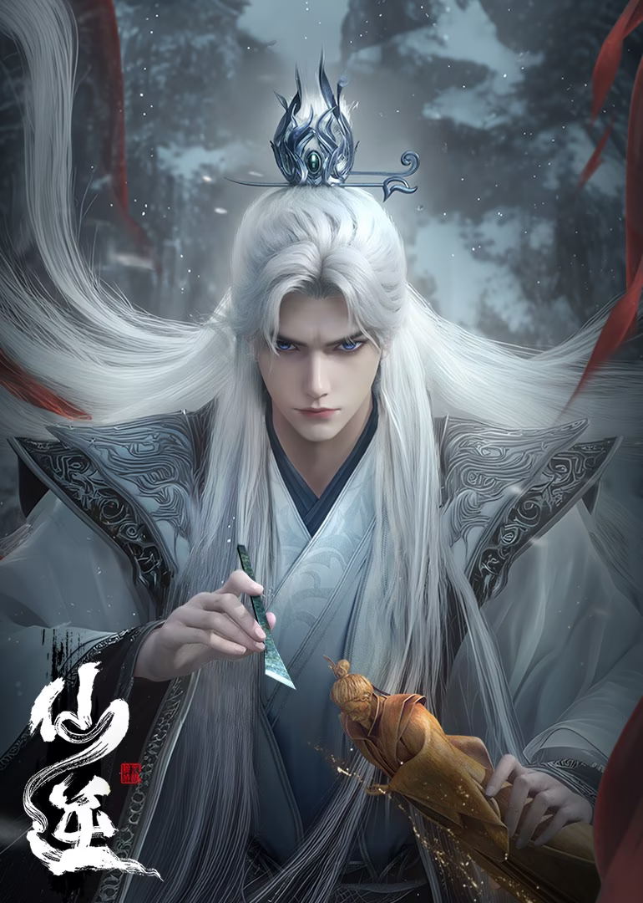

# Monday

## 武道大帝
+ 
+ 简介：出身贫寒，天赋普通的少年罗修，意外融合诸天大道本源至宝轮回珠，能自视身体，看透生命，改良武道功法秘籍。于是从此摆脱平凡，拳开天路，执掌轮回，身镇诸天万界，威压大道万古，成为一代大帝，傲视古今。
+ 源自：<a href="https://www.iqiyi.com/v_11za575v9yo.html" target="_blank">爱奇艺</a>
+ 历史观看至 86 集、每周一09点更新
+ 当前状态：<input type="checkbox" name="复选框" value="已完结" disabled>已完结 / <input type="checkbox" name="复选框" value="未完结"  checked disabled>未完结 / <input type="checkbox" name="复选框" value="已停更" disabled>已停更
+ 第三方源1：<a href="http://cqdb6.com/acg/85272/" target="_blank">70KanKan</a>
+ 第三方源2：<a href="https://www.freeok.live/vod-detail/77069.html" target="_blank">FreeOK</a>

## 仙逆
+ 
+ 简介：改编自耳根同名小说《仙逆》，讲述了乡村平凡少年王林以心中之感动，逆仙而修，求的不仅是长生，更多的是摆脱那背后的蝼蚁之身。他坚信道在人为，以平庸的资质踏入修真仙途，历经坎坷风雨，凭着其聪睿的心智，一步一步走向巅峰，凭一己之力，扬名修真界
+ 源自：<a href="https://v.qq.com/x/cover/mzc00200aaogpgh/r0047gdjpw6.html" target="_blank">腾讯视频</a>
+ 历史观看至 84 集、每周一10点更新
+ 当前状态：<input type="checkbox" name="复选框" value="已完结" disabled>已完结 / <input type="checkbox" name="复选框" value="未完结"  checked disabled>未完结 / <input type="checkbox" name="复选框" value="已停更" disabled>已停更
+ 第三方源1：<a href="http://cqdb6.com/acg/75241/" target="_blank">70KanKan</a>
+ 第三方源2：<a href="https://www.freeok.live/vod-detail/127.html" target="_blank">FreeOK</a>
+ 第三方源3：<a href="https://www.agedm.org/detail/20230317" target="_blank">ACG动漫</a>
