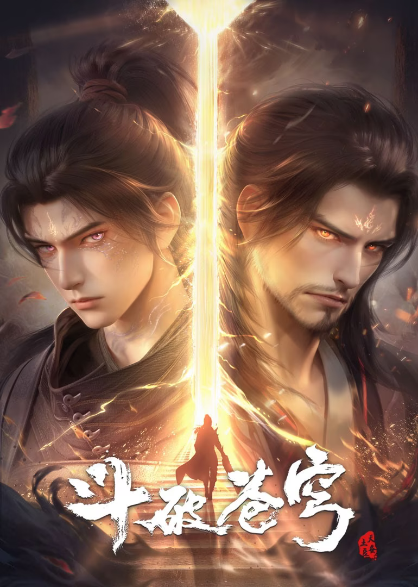

# Sunday

## 斗破苍穹年番
+ 
+ 简介：萧炎横扫云岚宗成功复仇，谁知药老的灵魂却被魂殿掳走。为抓萧炎，魂殿暗借小医仙之手，命毒宗围剿萧炎的炎盟。刚晋级斗皇的萧炎虽成功化解危机，却也身中魔毒斑。为解此毒，更是为了解救药老，萧炎带着小医仙和紫研前往中州，殊不知，等待他们命运的竟然是…… 
+ 源自：<a href="https://v.qq.com/x/cover/mzc0020027yzd9e/q0043cz9x20.html" target="_blank">腾讯视频</a>
+ 最新观看至 143 集、每周日10点更新
+ 当前状态：<input type="checkbox" name="复选框" value="已完结" disabled>已完结 / <input type="checkbox" name="复选框" value="未完结"  checked disabled>未完结 / <input type="checkbox" name="复选框" value="已停更" disabled>已停更
+ 第三方源1：<a href="http://cqdb6.com/acg/57416/" target="_blank">70KanKan</a>
+ 第三方源2：<a href="https://www.freeok.live/vod-detail/223.html" target="_blank">FreeOK</a>
+ 第三方源3：<a href="https://www.agedm.org/detail/20220408" target="_blank">ACG动漫</a>

## 牧神记
+ 
+ 简介：主角秦牧，幼时被一女尸托举至涌江边并被司婆婆捡到，村长根据玉佩上的字为其取名为“秦牧”。被一只母牛哺乳长大，是天生凡体，但被村长骗为霸体，修炼霸体三丹功。后走出大墟闯荡，进入京城，拜入太学院。历经考验成为天魔教教主，并被延康国封为第一任太学博士。秦牧在延康国叛乱之战中引来魔神，掀起浩荡风云，后随武可汗入楼兰黄金宫，一个人打遍圣宫无敌手，麻翻无数大巫，盗走无数珍宝。后返回延康，助国师平叛、入京城斩杀太子、造射日神炮。秦牧得人皇传承成为新一代人皇。机缘巧合下遇到了亲生父亲，揭开了自己的身世，借助道门小玉京等人的帮助，开启了道法神通改革的大世。一步步逐渐成长，作为延康变法三杰之一，为芸芸众生而战。
+ 源自：<a href="https://www.bilibili.com/bangumi/play/ss45969" target="_blank">哔哩哔哩动画</a>
+ 最新观看至 26 集、每周日11点更新
+ 当前状态：<input type="checkbox" name="复选框" value="已完结" disabled>已完结 / <input type="checkbox" name="复选框" value="未完结"  checked disabled>未完结 / <input type="checkbox" name="复选框" value="已停更" disabled>已停更
+ 第三方源1：<a href="http://cqdb6.com/acg/101420/" target="_blank">70KanKan</a>
+ 第三方源2：<a href="https://www.freeok.live/vod-detail/75392.html" target="_blank">FreeOK</a>
